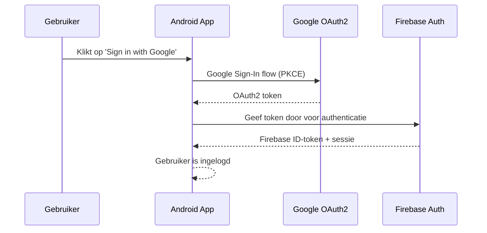

### 🔐 Login Flow met Firebase (google authenticatie en OAuth2)

```mermaid
sequenceDiagram
    participant U as Gebruiker
    participant App as Android App
    participant Google as Google OAuth2
    participant Firebase as Firebase Auth

    U->>App: Klikt op 'Sign in with Google'
    App->>Google: Google Sign-In flow (PKCE)
    Google-->>App: OAuth2 token
    App->>Firebase: Geef token door voor authenticatie
    Firebase-->>App: Firebase ID-token + sessie
    App-->>App: Gebruiker is ingelogd
```
